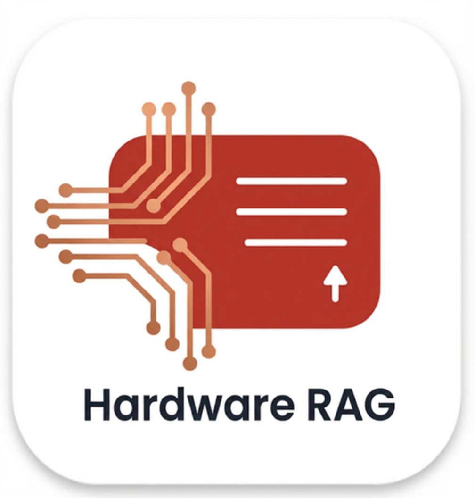

<div align="center">



*Enhance the retrieval assistant with hardware documentation to retrieve hardware documentation.*

<p>

<b>Hardware RAG 是一个专为硬件技术文档设计的本地轻量化知识库问答系统，<br></b>
<b> 能够通过克隆仓库到本地, 实现小团队的知识库搭建和问答, 也可以用于RAG检索流程的学习 </b>

<b>基于 LlamaIndex 和 Streamlit 构建</b>

<br>

*如果该项目对你有用, 欢迎star🌟 &  fork🍴*

<br>

</p>

</div>

---
# 🐱 部署示例
## 📚知识库管理


## 🤖检索聊天


---
## ✨ 核心特性

- **高级混合检索架构** :
  - **语义检索** : 基于 Embedding 的向量相似度搜索。
  - **关键词检索** : 基于 BM25 的关键词匹配，弥补语义丢失。
  - **RRF 融合** : 使用 Reciprocal Rank Fusion 算法合并双路检索结果。
  - **Reranker 重排序** : 引入 Cross-Encoder 模型对结果进行二次精排，大幅提升回答准确度。

- **知识库管理** :
  - **多库隔离** : 支持创建多个独立的知识库（Project），一键切换。
  - **增量更新** : 随时上传新文档，自动建立索引，无需重建整个库。
  - **精细删除** : 支持删除知识库中的单个文件及其对应的向量数据。

- **灵活的模型支持** :
  - **纯本地模式** : 支持通过 Ollama 运行 LLM 和 Embedding，数据不出域。
  - **混合模式** : 本地 Embedding (免费/快) + 云端 LLM (智能/强)。
  - **高可用** : 内置 API 重试与降级机制，应对网络波动和限流。

## 📂 项目结构

```
Hardware-RAG/
├── assets/                  # 应用示例图片
├── config/
│   └── settings.py          # 全局配置与环境变量加载
├── data/                    # (自动生成) 原始文档存储路径
├── storage/                 # (自动生成) 向量数据库与缓存
├── src/
│   ├── core/
│   │   ├── custom_embedding.py # 自定义 Embedding
│   │   ├── custom_llm.py       # 自定义 LLM 封装
│   │   ├── custom_rag_chat.py  # 聊天核心逻辑
│   │   ├── hybrid_retriever.py # 混合检索实现
│   │   ├── rag_pipeline.py     # RAG 业务流程控制
│   │   └── resource_manager.py # 资源与连接池管理
│   └── ingestion/
│       └── index_builder.py    # 索引构建器
│   
├── .env                     # 环境变量配置文件
├── uv.lock                  # 依赖锁定文件
├── pyproject.toml           # uv 项目配置文件
├── requirements.txt         # 项目依赖
├── streamlit_app.py        # 前端启动入口
└── README.md                # 说明文档
```

## 🛠️ 环境准备

- **Python**: >= 3.10
- **Ollama** : 如果计划使用本地模型，请先安装并启动 [Ollama](https://ollama.com/)。

---

## 🚀 安装部署

本项目支持使用新一代包管理工具 **uv** 进行部署，也支持传统的 `requirements.txt` 方式。

### 方式一：使用 uv (推荐)

[uv](https://github.com/astral-sh/uv) 是一个极速的 Python 包管理器。

### **安装 uv** (如果尚未安装):

**MacOS / Linux:**
```bash
curl -LsSf https://astral.sh/uv/install.sh | sh
```
**Windows (PowerShell):**
```bash
powershell -c "irm https://astral.sh/uv/install.ps1 | iex"
```
### **一键同步环境**

在项目根目录下运行以下命令。这将读取 uv.lock 并自动创建虚拟环境、安装所有精确版本的依赖。
```bash
uv sync
```

### **启动应用**

使用 uv run 启动，它会自动加载虚拟环境，无需手动 activate。
```bash
uv run streamlit run streamlit_app.py
```

### 方式二：使用 pip 部署 (🐢 传统方式)
如果你无法使用 uv，可以使用传统的 requirements.txt 进行部署。

### **创建虚拟环境** :
```bash
# 创建环境
python -m venv venv

# 激活环境
# Windows:
venv\Scripts\activate
# macOS/Linux:
source venv/bin/activate
```
### **安装依赖** :

```bash
pip install -r requirements.txt
```

### **启动应用** :
```bash
streamlit run src/streamlit_app.py
```
## ⚙️ 配置说明

在项目根目录下创建一个 .env 文件（可参考 .env.example）。
```
# ==================== 模式选择 ====================
# ollama: 全本地模式 | custom: 调用第三方 API
PROVIDER=ollama

# ==================== 本地模式配置 (Ollama) ====================
OLLAMA_BASE_URL=http://localhost:11434
OLLAMA_LLM_MODEL=qwen2.5:32b
OLLAMA_EMBEDDING_MODEL=nomic-embed-text:latest

# ==================== 云端 API 配置 (OpenRouter/DeepSeek) ====================
# 仅当 PROVIDER=custom 时生效
CUSTOM_API_KEY=sk-xxxxxxxxxxxxxxxxxxxxxxxx
CUSTOM_BASE_URL=https://openrouter.ai/api/v1
CUSTOM_LLM_MODEL=deepseek/deepseek-chat

# [可选] 混合模式开关
# 设置为 true 表示：使用云端 LLM 回答，但使用本地 Ollama 做向量化 (省钱且快)
USE_OLLAMA_EMBEDDING=false

# ==================== RAG 检索参数 ====================
CHUNK_SIZE=512
VECTOR_TOP_K=20
BM25_TOP_K=20
# 最终展示给大模型的片段数
FINAL_TOP_K=5

# ==================== 重排序 (Reranker) ====================
# 类型: none, local, ollama, api
RERANKER_TYPE=none
```
## ❓ 常见问题

Q: 运行 uv sync 时提示 lock file is not up to date?

A: 这通常发生在手动修改了 pyproject.toml 后。请运行 uv lock 更新锁定文件，然后再运行 uv sync。

Q: 启动时提示 ModuleNotFoundError?

A: 如果使用 uv，必须使用 uv run ... 启动命令，或者手动 source .venv/bin/activate 后再运行。

Q: 上传文件后搜索不到内容？

A:

1. 检查控制台日志，确认文件是否索引成功。

2. 确保 .env 中的 Embedding 模型配置正确。

3. 如果是中文文档，BM25 依赖 Jieba 分词，系统会自动处理，但请确保文档编码为 UTF-8。

## 📜 License
MIT License